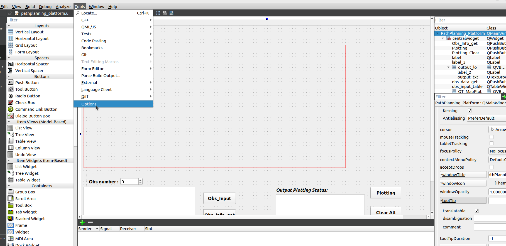
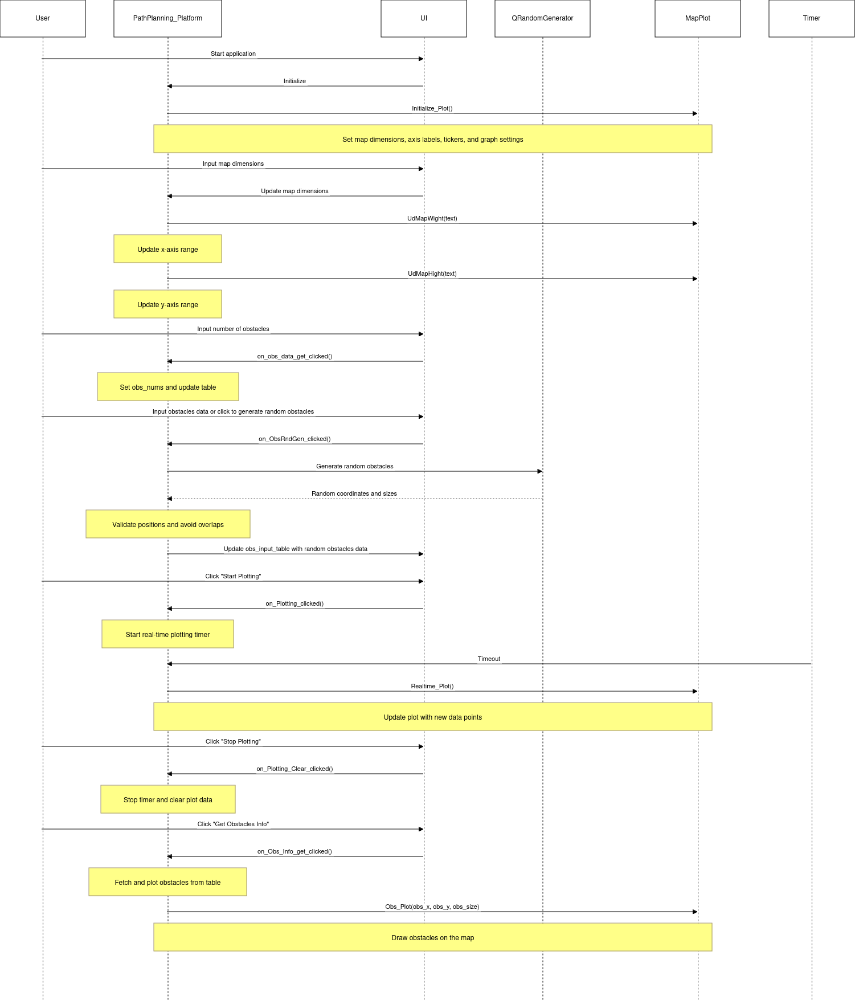
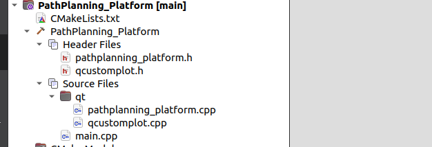
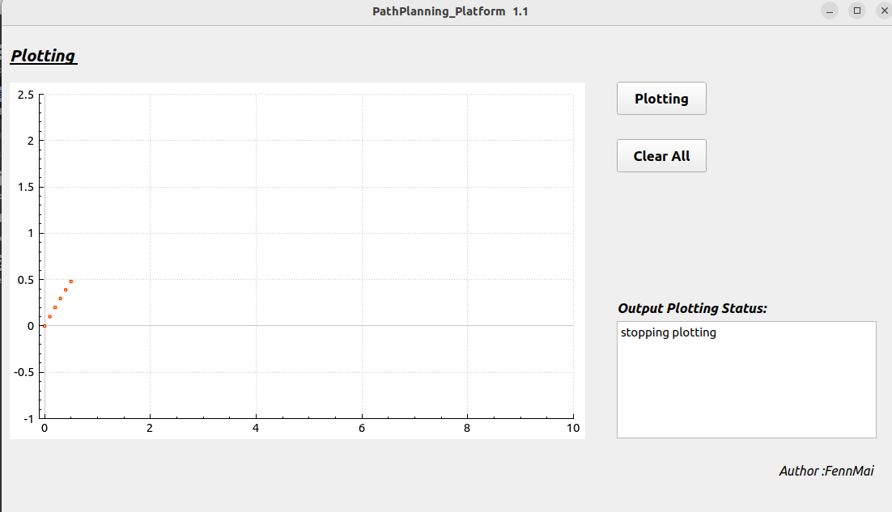
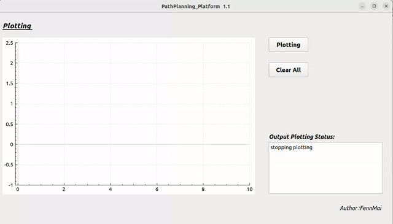

## 1. Diary
#### 20240508 goal and finished

source: `qcustomplot`
1. initial_gragh---`Initialize_Plot`
2. live plotting(sinx)--- ``
3. define the shape of gragh from input button

`Plotting`button clicked---`Printing_Timer`start---`Realtime_Plot` start 

`clear all`button clicked---`Printing_Timer`stop---`MapPlot`clear

#### 20240509 goal
1. define the obstacles generator
step 1: Define two obs modes, a. Custom input obstacles; b. Randomly generated
**a.** custom input obstacles ui flow: 
"ask obs nums:xx" --> define a empty table([nums,3])


1. design real-time APF

#### 20240516 finished
1. **a.** custom input obstacles ui flow: 
"ask obs nums:xx" --> push button `Obs_Input`, define a empty table([nums,3])--> write down the obs info -->  push button `Obs_Info_get`, store the data in the vector `obs_info`, plot the Ellipse in `MapPlot`

#### 20240516
1. from 20240515, the project Project code standards tend to be Oxygen format specifications.
However, Oxygen adapted for Qt Creator has not been updated for many years. So I learned from online tutorials and customized two formats
```
header version notes:
* @version   1.2
* @author    Fennmai
* @date      16/05/2024
* @brief
* 1. 
* 2.
* 3.

cpp function notes:
/*************************************************
**Function: 
**Description: 
**Input: 
**Output: 
**Return: 
**Others: 
*************************************************/
```
setting step1:

setting step2:


#### 20240518
1. feat: Adjust map size in real time
2. feat: obstacles generators mode 2 - Random Generator


## 2. debug

1. 20240508 
**Could not find the 'ui'file in QTCreator**


**solution:**
I forgot to define it in the CMakeLists.txt, adding it now.
>set(PROJECT_SOURCES src/qt/pathplanning_platform.ui)

2. 20240508
when I setting the `clear all`button, the original objective:1. stop the Printing_Timer;2. clear the graph;
Objective1 is achieved,but Objective2 can not achieve, as shown below


**solution:**

before:
```
void PathPlanning_Platform::on_Plotting_Clear_clicked()
{
    Printing_Timer->stop();
    ui->output_txt->setText("stopping plotting");
    MapPlot->graph(0)->data()->clear();
}
```
after:
```
void PathPlanning_Platform::on_Plotting_Clear_clicked()
{
    Printing_Timer->stop();
    ui->output_txt->setText("stopping plotting");
    MapPlot->graph(0)->data()->clear(); // 清除数据
    MapPlot->replot(); // 重要：调用 replot 来更新图表显示
}
```
3. 20240508
另一个问题，当我按下了Plotting，开始实时画图，然后按下Plotting_Clear，可以正常停下timer，清除graph(0)内容。但是，当我再按下Plotting，它是从上一次停下的点开始继续画，这不是我想要的。我想要它每次Plotting，都是重头开始.

**solution:**
```
rt_location.x = 0; 
错误:
放在Realtime_Plot()里面。不行，因为Realtime_Plot是每次timer都会调用触发的，
它会一直触发x=0,导致图只会画第一个点

正确：放入`on_Plotting_clicked`因为目标就是按钮被按下，重新开始，
它在这里只会执行一次

```
4. 20240508
每个版本规范迭代，如何更好的记录和显示每个版本的功能和结果？

**solution:**
1. 提炼记录每个版本的开发内容。
2. 录屏--->转换成gif--->保存到markdown中
   
e.g.
Now:sinx , x (0.6)



terminal:
```
ffmpeg -i "xxxname.webm" -filter_complex "[0:v] fps=15,scale=800:-1:flags=lanczos,split [a][b];[a] palettegen [p];[b][p] paletteuse" output.gif
```
If the image quality is too low, change the scale.
e.g. scale=1024...


